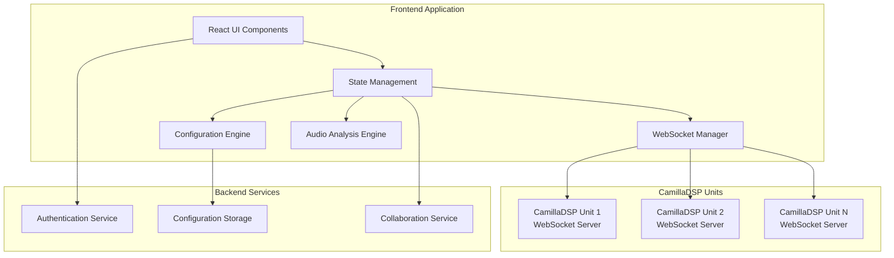

# Design Document: CamillaDSP Frontend

## Overview

The CamillaDSP Frontend is a comprehensive web-based application that provides intuitive control and management of multiple CamillaDSP units. The application bridges the gap between CamillaDSP's powerful but technical YAML configuration system and users who need an accessible interface for complex audio processing tasks.

The frontend architecture follows a modern web application pattern with a React-based client communicating with CamillaDSP units via WebSocket connections. The application provides real-time parameter control, visual pipeline building, comprehensive monitoring, and full YAML configuration compatibility.

## Architecture

### High-Level Architecture



### Component Architecture

The application follows a layered architecture:

1. **Presentation Layer**: React components with Material-UI for consistent design
2. **State Management Layer**: API state management
3. **Communication Layer**: WebSocket managers for real-time DSP communication
4. **Business Logic Layer**: Configuration engine, audio analysis, and validation
5. **Data Layer**: Local storage, configuration persistence, and collaboration backend

## Components and Interfaces

### Core Components

#### 1. Multi-Unit Manager
**Purpose**: Manages connections to multiple CamillaDSP units
**Key Features**:
- Network discovery of CamillaDSP units
- Connection state management and health monitoring
- Automatic reconnection with exponential backoff
- Load balancing for multiple unit access

**Interface**:
```typescript
interface MultiUnitManager {
  discoverUnits(): Promise<DSPUnit[]>
  connectToUnit(unit: DSPUnit): Promise<Connection>
  disconnectFromUnit(unitId: string): Promise<void>
  getConnectionStatus(unitId: string): ConnectionStatus
  subscribeToStatusChanges(callback: StatusCallback): void
}

interface DSPUnit {
  id: string
  name: string
  address: string
  port: number
  version: string
  status: 'connected' | 'disconnected' | 'error'
}
```

#### 2. Audio Matrix Component
**Purpose**: Condensed visual representation of the complete signal processing pipeline with interactive editing for all CamillaDSP filter types
**Key Features**:
- Interactive grid showing inputs, all processing stages, and outputs
- Support for all CamillaDSP filter types (Biquad, Conv, Gain, Delay, Dither, DiffEq, Crossover, EQ)
- Visual indication of signal flow through pipeline stages
- Click-to-edit functionality for all pipeline elements with type-specific parameter controls
- Real-time visualization of processing chain with filter-specific condensed displays
- Condensed view showing filter type, key parameters, and signal routing

**Supported Filter Types in Matrix**:
- **Biquad Filters**: Display filter type (HP/LP/Peak/Shelf) and frequency
- **Convolution Filters**: Display impulse response filename and length
- **Crossover Filters**: Display crossover type, order, and frequency
- **Delay Filters**: Display delay time and unit (ms/samples)
- **Gain Filters**: Display gain value and inversion status
- **Dither Filters**: Display dither type and target bit depth
- **DiffEq Filters**: Display coefficient count and filter description
- **EQ Filters**: Display frequency bands and overall curve shape
- **Mixers**: Display input/output channel mapping

**Interface**:
```typescript
interface AudioMatrix {
  inputs: AudioChannel[]
  outputs: AudioChannel[]
  pipelineStages: PipelineStageView[]
  connections: MatrixConnection[]
  onConnectionToggle(input: number, output: number): void
  onStageClick(stageId: string): void
  onStageEdit(stageId: string, newConfig: StageConfig): void
  onGainChange(connection: MatrixConnection, gain: number): void
  onFilterParameterChange(stageId: string, parameter: string, value: any): void
  getCondensedFilterDisplay(stage: PipelineStageView): string
}

interface MatrixFilterEditor {
  editBiquadFilter(filter: BiquadFilter): void
  editConvolutionFilter(filter: ConvolutionFilter): void
  editCrossoverFilter(filter: CrossoverFilter): void
  editDelayFilter(filter: DelayFilter): void
  editGainFilter(filter: GainFilter): void
  editDitherFilter(filter: DitherFilter): void
  editDiffEqFilter(filter: DiffEqFilter): void
  editEQFilter(filter: EQFilter): void
  validateFilterParameters(filterType: string, params: FilterParameters): ValidationResult
}

interface PipelineStageView {
  id: string
  type: 'Filter' | 'Mixer' | 'Gain' | 'Delay'
  filterType?: 'Biquad' | 'Conv' | 'Gain' | 'Delay' | 'Dither' | 'DiffEq' | 'EQ' | 'Crossover' | 'Convolution'
  name: string
  inputChannels: number
  outputChannels: number
  condensedDisplay: string // Brief description for matrix view
  editableInMatrix: boolean
  parameters: FilterParameters
}

interface FilterParameters {
  // Biquad Filter Parameters
  biquadType?: 'Highpass' | 'Lowpass' | 'Peaking' | 'Shelving' | 'Notch' | 'Allpass' | 'Bandpass'
  frequency?: number
  q?: number
  gain?: number
  
  // Convolution Filter Parameters
  impulseResponseFile?: string
  convolutionLength?: number
  
  // Crossover Filter Parameters
  crossoverType?: 'LinkwitzRiley' | 'Butterworth'
  crossoverOrder?: number
  crossoverFrequency?: number
  
  // Delay Filter Parameters
  delayTime?: number
  delayUnit?: 'ms' | 'samples'
  
  // Gain Filter Parameters
  gainValue?: number
  inverted?: boolean
  
  // Dither Filter Parameters
  ditherType?: 'Simple' | 'Lipshitz' | 'Fweighted' | 'Shibata'
  targetBits?: number
  
  // Difference Equation Filter Parameters
  aCoefficients?: number[]
  bCoefficients?: number[]
}

interface MatrixConnection {
  inputChannel: number
  outputChannel: number
  pipelineStages: string[] // IDs of stages in the signal path
  gain: number
  inverted: boolean
  active: boolean
}
```

#### 3. DSP Filter Configuration Engine
**Purpose**: Manages all filter types and their parameters
**Key Features**:
- Support for all CamillaDSP filter types
- Real-time parameter validation
- Frequency response calculation and visualization
- Filter coefficient generation

**Interface**:
```typescript
interface FilterEngine {
  createFilter(type: FilterType, params: FilterParams): DSPFilter
  updateFilter(filterId: string, params: Partial<FilterParams>): void
  calculateFrequencyResponse(filter: DSPFilter): FrequencyResponse
  validateParameters(type: FilterType, params: FilterParams): ValidationResult
}

type FilterType = 
  | 'Biquad' | 'Conv' | 'Gain' | 'Delay' | 'Dither' | 'DiffEq'

interface BiquadParams {
  type: 'Highpass' | 'Lowpass' | 'Peaking' | 'Shelving' | 'Notch' | 'Allpass' | 'Bandpass'
  freq: number
  q?: number
  gain?: number
  slope?: number
}
```

#### 4. Pipeline Builder
**Purpose**: Visual pipeline construction with drag-and-drop interface
**Key Features**:
- Drag-and-drop filter and mixer arrangement
- Real-time validation of pipeline compatibility
- Visual signal flow representation
- Channel count tracking and validation

**Interface**:
```typescript
interface PipelineBuilder {
  stages: PipelineStage[]
  addStage(stage: PipelineStage, position: number): void
  removeStage(stageId: string): void
  moveStage(stageId: string, newPosition: number): void
  validatePipeline(): ValidationResult
}

interface PipelineStage {
  id: string
  type: 'Filter' | 'Mixer'
  name: string
  inputChannels: number
  outputChannels: number
  parameters: Record<string, any>
}
```

#### 5. Real-Time Control Manager
**Purpose**: Handles real-time parameter updates via WebSocket
**Key Features**:
- Sub-50ms parameter update latency
- Command queuing and retry logic
- Conflict resolution for concurrent updates
- Undo/redo functionality

**Interface**:
```typescript
interface RealTimeController {
  sendParameterUpdate(unitId: string, path: string, value: any): Promise<void>
  subscribeToUpdates(unitId: string, callback: UpdateCallback): void
  queueCommand(command: DSPCommand): void
  undo(): Promise<void>
  redo(): Promise<void>
}

interface DSPCommand {
  type: 'SetConfig' | 'UpdateFilter' | 'UpdateMixer' | 'Reload'
  unitId: string
  payload: any
  timestamp: number
}
```

#### 6. Configuration Manager
**Purpose**: YAML configuration handling and persistence
**Key Features**:
- Full CamillaDSP YAML compatibility
- Configuration versioning and history
- Template system for common setups
- Import/export functionality

**Interface**:
```typescript
interface ConfigurationManager {
  loadConfiguration(source: ConfigSource): Promise<DSPConfiguration>
  saveConfiguration(config: DSPConfiguration): Promise<void>
  exportConfiguration(config: DSPConfiguration, format: ExportFormat): string
  validateConfiguration(config: DSPConfiguration): ValidationResult
  getConfigurationHistory(configId: string): ConfigVersion[]
}

interface DSPConfiguration {
  devices: DeviceConfig
  mixers: Record<string, MixerConfig>
  filters: Record<string, FilterConfig>
  pipeline: PipelineStage[]
  metadata: ConfigMetadata
}
```

#### 7. Audio Analysis Engine
**Purpose**: Real-time audio monitoring and analysis
**Key Features**:
- Multi-stage level metering
- Spectrum analysis with configurable FFT
- Frequency response plotting
- Performance metrics monitoring

**Interface**:
```typescript
interface AudioAnalyzer {
  getLevelMeters(unitId: string): Promise<LevelMeterData>
  getSpectrumData(unitId: string, fftSize: number): Promise<SpectrumData>
  calculateFrequencyResponse(filters: DSPFilter[]): FrequencyResponse
  getPerformanceMetrics(unitId: string): Promise<PerformanceMetrics>
}

interface LevelMeterData {
  channels: ChannelLevel[]
  timestamp: number
}

interface ChannelLevel {
  channel: number
  peak: number
  rms: number
  clipping: boolean
}
```

### Data Models

#### Core Data Structures

```typescript
// Device Configuration
interface DeviceConfig {
  samplerate: number
  chunksize: number
  queuelimit?: number
  silence_threshold?: number
  silence_timeout?: number
  target_level?: number
  adjust_period?: number
  enable_rate_adjust?: boolean
  enable_resampling?: boolean
  resampler_type?: ResamplerType
  capture_samplerate?: number
  capture: AudioDevice
  playback: AudioDevice
}

interface AudioDevice {
  type: 'Alsa' | 'Pulse' | 'Wasapi' | 'CoreAudio' | 'File' | 'Stdin' | 'Stdout'
  channels: number
  device: string
  format: SampleFormat
  filename?: string
}

// Filter Configurations
interface FilterConfig {
  type: FilterType
  parameters: FilterParams
}

interface ConvolutionFilter extends FilterConfig {
  type: 'Conv'
  parameters: {
    type: 'File' | 'Values'
    filename?: string
    values?: number[]
    format?: 'TEXT' | 'FLOAT32LE' | 'FLOAT64LE'
    skip_bytes_lines?: number
    read_bytes_lines?: number
  }
}

interface BiquadFilter extends FilterConfig {
  type: 'Biquad'
  parameters: BiquadParams | {
    type: 'Free'
    a1: number
    a2: number
    b0: number
    b1: number
    b2: number
  }
}

// Mixer Configuration
interface MixerConfig {
  channels: {
    in: number
    out: number
  }
  mapping: MixerMapping[]
}

interface MixerMapping {
  dest: number
  sources: MixerSource[]
}

interface MixerSource {
  channel: number
  gain: number
  inverted: boolean
}
```

## Correctness Properties

*A property is a characteristic or behavior that should hold true across all valid executions of a system—essentially, a formal statement about what the system should do. Properties serve as the bridge between human-readable specifications and machine-verifiable correctness guarantees.*

Before writing the correctness properties, I need to analyze the acceptance criteria from the requirements to determine which ones are testable as properties, examples, or edge cases.

### Core Correctness Properties

**Property 1: Connection State Consistency**
*For any* DSP unit and connection state change, the Frontend should maintain consistent connection status across all UI components and attempt reconnection when connections are lost
**Validates: Requirements 1.1, 1.2, 1.3, 1.4, 5.1, 5.7, 8.7**

**Property 2: Audio Matrix Pipeline Representation**
*For any* complete signal processing pipeline, the audio matrix should display a condensed view of all processing stages and allow direct editing of pipeline elements when clicked
**Validates: Requirements 2.1, 2.2, 2.3, 2.4, 2.5**

**Property 3: Real-time Parameter Update Latency**
*For any* parameter change, the Frontend should send WebSocket commands to the DSP unit within 50ms and update all relevant UI components immediately
**Validates: Requirements 2.4, 5.2, 7.1**

**Property 4: Filter Configuration Completeness**
*For any* supported filter type, the Frontend should provide all necessary configuration parameters and apply them correctly to the DSP unit
**Validates: Requirements 3.2, 3.4, 3.5, 3.6, 3.8**

**Property 5: Pipeline Validation and Consistency**
*For any* pipeline configuration, the Frontend should validate channel count compatibility between stages and prevent invalid configurations with clear error messages
**Validates: Requirements 4.1, 4.2, 4.4, 4.5, 4.6**

**Property 6: Configuration Round-trip Integrity**
*For any* valid DSP configuration, saving to YAML format then loading should produce an equivalent configuration with all parameters preserved
**Validates: Requirements 6.1, 6.2, 6.4**

**Property 7: Multi-user Collaboration Consistency**
*For any* concurrent configuration changes by multiple users, the Frontend should detect conflicts, resolve them appropriately, and maintain data consistency across all user sessions
**Validates: Requirements 5.5, 10.1, 10.2, 10.3, 10.7**

**Property 8: Audio Analysis Accuracy**
*For any* audio signal and analysis configuration, the Frontend should provide accurate level meters, spectrum analysis, and frequency response plots that reflect the actual signal characteristics
**Validates: Requirements 7.1, 7.2, 7.3, 7.4, 7.5, 7.6, 7.7**

**Property 9: Device Configuration Validation**
*For any* audio device configuration, the Frontend should validate compatibility between sample rates, formats, and backends, rejecting invalid combinations with helpful error messages
**Validates: Requirements 8.2, 8.4, 8.5, 8.6**

**Property 10: UI State Synchronization**
*For any* system state change, all UI components should update consistently to reflect the current state without requiring manual refresh
**Validates: Requirements 1.4, 2.3, 5.4, 9.2, 9.4**

**Property 11: Configuration History and Versioning**
*For any* configuration change, the Frontend should maintain complete history with timestamps, user attribution, and support undo/redo operations
**Validates: Requirements 5.6, 6.3, 10.4**

**Property 12: Data Persistence and Backup Integrity**
*For any* configuration data, automatic saves and backups should maintain data integrity through checksums and validation
**Validates: Requirements 10.1, 10.5**

## Error Handling

The application implements comprehensive error handling across all layers:

### Network and Connection Errors
- **WebSocket Connection Failures**: Automatic reconnection with exponential backoff
- **Network Timeouts**: Graceful degradation with offline mode capabilities
- **DSP Unit Unavailability**: Clear status indication and reconnection attempts
- **Authentication Failures**: Clear error messages with retry options

### Configuration Errors
- **Invalid YAML Syntax**: Detailed syntax error reporting with line numbers
- **Parameter Validation Failures**: Context-specific error messages with suggested corrections
- **Pipeline Compatibility Issues**: Visual indicators of incompatible connections
- **Missing Dependencies**: Automatic dependency resolution or clear missing dependency reports

### Real-time Processing Errors
- **Parameter Update Failures**: Retry logic with fallback to last known good state
- **Audio Buffer Underruns**: Automatic buffer size adjustment recommendations
- **Filter Coefficient Errors**: Validation before application with rollback capability
- **Performance Issues**: Automatic performance monitoring with optimization suggestions

### User Interface Errors
- **Responsive Design Failures**: Graceful degradation for unsupported screen sizes
- **Accessibility Issues**: Fallback mechanisms for screen reader compatibility
- **Browser Compatibility**: Feature detection with polyfills or alternative implementations

### Data Persistence Errors
- **Storage Quota Exceeded**: Automatic cleanup of old configurations with user notification
- **Corruption Detection**: Automatic backup restoration with integrity verification
- **Concurrent Access Conflicts**: Merge conflict resolution with user guidance

## Testing Strategy

The testing approach combines unit testing for specific functionality with property-based testing for universal correctness guarantees.

### Unit Testing Focus Areas
- **Component Integration**: Testing interactions between React components and Redux state
- **WebSocket Communication**: Mock DSP units for testing connection handling and command processing
- **Configuration Parsing**: Specific YAML parsing scenarios and edge cases
- **Audio Analysis Algorithms**: Known input/output pairs for spectrum analysis and level metering
- **User Interface Interactions**: Specific user workflows and accessibility compliance

### Property-Based Testing Configuration
- **Testing Library**: fast-check for JavaScript/TypeScript property-based testing
- **Test Iterations**: Minimum 100 iterations per property test for comprehensive coverage
- **Generator Strategy**: Custom generators for DSP configurations, audio data, and user interactions
- **Shrinking Strategy**: Automatic test case minimization for failure analysis

### Property Test Implementation
Each correctness property will be implemented as a property-based test with the following structure:

```typescript
// Example property test structure
describe('Property 6: Configuration Round-trip Integrity', () => {
  it('should preserve all parameters through save/load cycle', () => {
    fc.assert(fc.property(
      generateValidDSPConfiguration(),
      (config) => {
        // Feature: camilla-dsp-frontend, Property 6: Configuration round-trip integrity
        const yamlString = configManager.saveConfiguration(config);
        const loadedConfig = configManager.loadConfiguration(yamlString);
        expect(loadedConfig).toEqual(config);
      }
    ), { numRuns: 100 });
  });
});
```

### Integration Testing
- **End-to-End Workflows**: Complete user journeys from connection to configuration deployment
- **Multi-User Scenarios**: Concurrent access testing with multiple browser sessions
- **Performance Testing**: Load testing with multiple DSP units and complex configurations
- **Cross-Platform Testing**: Browser compatibility and responsive design validation

### Continuous Integration
- **Automated Test Execution**: All tests run on every commit with failure notifications
- **Performance Regression Detection**: Automated performance benchmarking
- **Accessibility Testing**: Automated accessibility compliance checking
- **Security Testing**: Automated vulnerability scanning and dependency checking